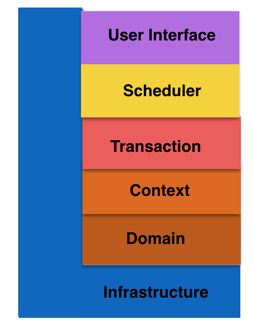

# PPAP

笔者在实践中，将这六层的本地化定义为：

1. User Interface是用户接口层，主要用于处理用户发送的Restful请求和解析用户输入的配置文件等，并将信息传递给Scheduler层的接口。
2. Scheduler是调度层，负责多进程管理及调度、多线程管理及调度、多协程调度和维护业务实例的状态模型。当调度层收到用户接口层的请求后，委托Transaction层与本次操作相关的事务进行处理。
3. Transaction是事务层，对应一个业务流程，比如UE Attach，将多个同步消息或异步消息的处理序列组合成一个事务，而且在大多场景下，都有选择结构。万一事务执行失败，则立即进行回滚。当事务层收到调度层的请求后，委托Context层的Action进行处理，常常还伴随使用Context层的Specification（谓词）进行Action的选择。
4. Context是环境层，以Action为单位，处理一条同步消息或异步消息，将Domain层的领域对象cast成合适的role，让role交互起来完成业务逻辑。环境层通常也包括Specification的实现，即通过Domain层的知识去完成一个条件判断。
5. Domain层是领域层，定义领域模型，不仅包括领域对象及其之间关系的建模，还包括对象的角色role的显式建模。
6. Infrastructure层是基础实施层，为其他层提供通用的技术能力：业务平台，编程框架，持久化机制，消息机制，第三方库的封装，通用算法，等等。

事务层的核心是事务模型，事务模型的框架代码一般放在基础设施层。关于事务模型，笔者以前分享过一篇文章—[《Golang事务模型》](https://www.jianshu.com/p/b7e874f6d3e8)，感兴趣的同学可以看看。

综上所述，DDD六层架构可以看做是DDD五层架构在特定领域的变体，我们统称为DDD五层架构，而DDD五层架构与传统的四层架构类似，都是**限定型松散分层架构**。

作者：_张晓龙_
链接：https://www.jianshu.com/p/a775836c7e25
来源：简书
著作权归作者所有。商业转载请联系作者获得授权，非商业转载请注明出处。