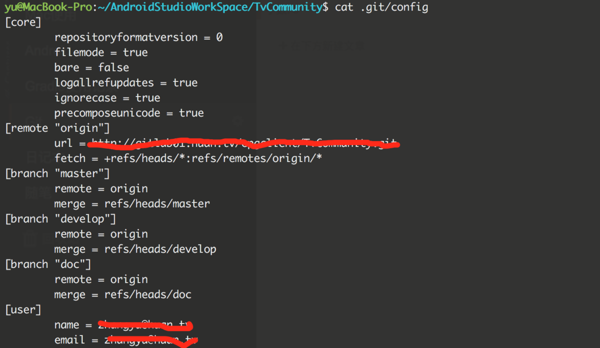
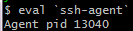
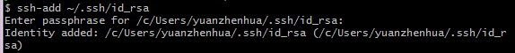
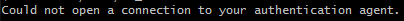
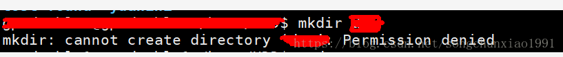

## 提交冲突

https://blog.csdn.net/weixin_42288182/article/details/96568718


主要原因是git仓库上已经存在readme文件，故在提交时可能会存在冲突，这时您需要选择的是保留线上的文件或者舍弃线上的文件：

#### 解决办法：

1、如果您舍弃线上的 文 件，则在推送时选择强制推送，强制推送需要执行下面的命令：
 `git push origin master -f`

2、如果您选择保留线上的readme文件,则需要先执行

```
git pull origin master
```


## 冲突Check out, review, and merge locally

```
git fetch git@gitlab.tuhu.cn:wangshuxin/Tuhu.Service.OrderSplit2019.git costLiner
git checkout -b wangshuxin/Tuhu.Service.OrderSplit2019-costLiner FETCH_HEAD
```


```
git checkout dev
git merge --no-ff wangshuxin/Tuhu.Service.OrderSplit2019-costLiner
```

```
git checkout dev
git merge --no-ff wangshuxin/Tuhu.Service.OrderSplit2019-costLiner
```


## Authentication failed for 解决办法


### 重新输入用户名和密码

$  git config --global --replace-all user.email "输入你的邮箱"

$  git config --global --replace-all user.name "输入你的用户名"

然后push  会提示重新输入用户名和密码


作者：special_lily
链接：https://www.jianshu.com/p/1f904566c8a2
来源：简书
著作权归作者所有。商业转载请联系作者获得授权，非商业转载请注明出处。

### ？？3


image.png

cat .git/config




image.png


 git remote set-url origin [http://xxx.git](https://link.jianshu.com?t=http://xxx.git)


image.png


OK！

## Permission denied

### 是ssh密匙的问题。

https://blog.csdn.net/qq_38656557/article/details/84615529

在学习git的时候，发现使用

```
git push -u origin master
```

命令推送到远程库的时候出现了Permission denied的问题。

经过查询资料，是ssh密匙的问题。

解决方法：本机生成密匙，github添加密匙。

首先，使用

```bash
ssh-keygen -t rsa -b 2048 -C "你的邮箱"
```

生成密匙，在本地C:\Users\你的用户名.ssh生成文件夹，里面有id_rsa和id_rsa.pub两个文件。

将id_rsa.pub里的复制到github里建立密匙即可。

```
git remote add origin_new 新的地址 


git remote –v查看 


git push origin_new master重新推送
```


### [ 【一种方式是使用ssh方式  使用git clone 出现 Permission denied 解决办法        ](https://www.cnblogs.com/jayworld/p/10419985.html)

从git复制项目到本地的一种方式是使用ssh方式，即在git bash中运行命令：git clone git@github.com:***.git

此种方式下载代码到本地的时候，可能出现Permission denied，原因在于此种方式依赖ssh key，SSH key可能失效或不存在。尝试以下步骤重新创建就可以解决。

 

\1. 检查本地ssh key是否存在

打开git bash，输入以下命令检查ssh key是否存在

```
ls` `~/.``ssh``/
```

若存在，跳过步骤2，不存在则执行步骤2。

 

\2. 生成ssh key

在git bash中执行以下命令

```
ssh``-keygen -t rsa -b 2048 -C ``"自己的邮箱地址"
```

若出现　

Generating public/private rsa key pair.
Enter file in which to save the key (/c/Users/***/.ssh/id_rsa):

***代表当前登录用户名，不做修改直接回车，会将生成的rsa文件保存为默认名称

回车之后提示

Enter passphrase (empty for no passphrase): 
Enter same passphrase again: 

提示设置提交/l拉取代码到Github时需要的密码及确认密码；

设置密码后再次回车提示Your identification has been saved in.... 即表示ssh key生成成功；

 

\3. 添加ssh key至ssh-agent

执行以下命令

`eval` ````ssh``-agent``

如果返回以下表示启用中



 

执行以下命令添加ssh key至ssh-agent

```
ssh``-add ~/.``ssh``/id_rsa
```

此步会要求输入步骤二设置的密码，输入密码后会出现



 

此步若是报错：



可以尝试关掉当前git bash窗口，重新以管理员身份运行git bash 

 

\4. 添加ssh key至guthub

登录https://github.com/，在页面右上角自己头像右边箭头处右击，弹框中进入setting功能；

setting界面右边菜单选择SSH and GPG keys，选择新建SSH keys，

保存即可；

 

完成以上步骤就可以使用ssh方式，用命令git clone git@github.com:***.git的形式下载项目到本地了。

 

​    分类:             [Git](


### =有权限进行读、写、创建文件、删除文件等操作

https://blog.csdn.net/songchunxiao1991/article/details/82629148

Permission denied：

出现的原因的是：没有权限进行读、写、创建文件、删除文件等操作。



解决方法：输入命令 sudo chmod -R 777  /工作目录，

例如：sudo chmode -R 777 /home/HDD，此时就可以在该路径下进行一系列的操作。

sudo：是linux系统管理指令，是允许系统管理员让普通用户执行一些或者全部的root命令的一个工具。

-R：是指几连医用到目录里所有子目录和文件；

777：是指所有用户都拥有的最高权限。


### =could not create   : Permission denied


 fatal: could not create work tree dir ‘xxxx’: Permission denied

​                                      https://blog.csdn.net/one_girl/article/details/82887067

```
git clone --recursive git://github.com/isaacs/npm.git
1
```

在执行上面命令从git上clone的时候报了错误，报这个错误的原因就是正在写入或者克隆git仓库的目录没有写入的权限。

```
fatal: could not create work tree dir 'npm': Permission denied
1
```

解决办法就是先修改目录的权限然后在进行操作

```
$ cd ../    （回退到当前目录的上一级）
$ sudo chmod o+w dirname  （dirname为当前目录的名字）
12
```

如果有密码的可能会提醒你输入密码，然后就可以重新执行git clone命令了*


### **=git add .的时候会出现"Permission denied"**

https://blog.csdn.net/double_lee3/article/details/90241989

开了另外一个账户，导致在git add .的时候会出现"Permission denied"的错误，这是由于公钥失效的问题导致的，要重新添加一个公钥进去。


先进去ssh文件位置cd~/.ssh，然后重新创建公钥ssh-kengen -t rsa -C "你的邮箱"，然后一路enter下去，最好换个名字，我的是123456随意，

https://www.cnblogs.com/jayworld/category/1358597.html)


## fatal: HTTP request failed

https://blog.csdn.net/shixiaoxiao2016/article/details/79925550

**第一种报错：**

fatal: HTTP request failed


解决一：


 执行#git config --global http.sslVerify false

解决二：

由于Git的版本太低导致，更新Git版本即可。

1、查看当前git版本：git --version

查看最新版git：访问https://www.kernel.org/pub/software/scm/git/或者https://github.com/git/git/releases

2、官网下载：
wget
https://Github.com/Git/Git/archive/v2.11.0.tar.gz
（建议本机迅雷下载rz到服务器,安装yum install lrzsz后rz即可）
解压：tar -zxvf git-2.11.0.tar.gz
3、cd git-2.11.0
4、移除旧版本git：yum remove git
5、make configure
如果报错/bin/sh: autoconf: command not found：
安装libtool即可：yum install install autoconf automake libtool
正常会打印：GEN configure
执行
6、./configure --prefix=/usr/local/git --with-iconv =/usr/local/lib（建议优先尝试后者）
或者
./configure --prefix=/usr/local/git --with-iconv --with-curl --with-expat=/usr/local/lib（如果没有安装libiconv请自行安装）
make && make install
①如果报错：cache.h:40:18: fatal error: zlib.h: No such file or directory
安装zlib：yum install zlib、yum install zlib-devel
②如果报错：make[1]: *** [perl.mak] Error 2
安装：yum install perl-ExtUtils-MakeMaker package
7、echo "export PATH=$PATH:/usr/local/git/bin" >> /etc/bashrc
8、source /etc/bashrc
9、git --version
编译git时报错： zlib.h: No such file or directory
缺少 zlib的头文件， 开发包没装，
yum install zlib （系统默认已经装上）
yum install zlib-devel
git clone时候提示fatal: Unable to find remote helper for 'https'
yum install libcurl-devel
然后按照上诉步骤重新安装编译git即可

参考：https://blog.csdn.net/u010887744/article/details/53957613 https://blog.csdn.net/wpyily/article/details/48130515


## fatal: unable to access目标地址

**https://blog.csdn.net/shixiaoxiao2016/article/details/79925550**

**第二种报错：**

执行git clone提示“fatal: unable to access目标地址”

```html
# git clone https://github.com/open-falcon/scripts.git


Cloning into 'scripts'...


fatal: unable to access 'https://github.com/open-falcon/scripts.git/': SSL connect error
```

解决办法：把https改为git即可                                    

## END